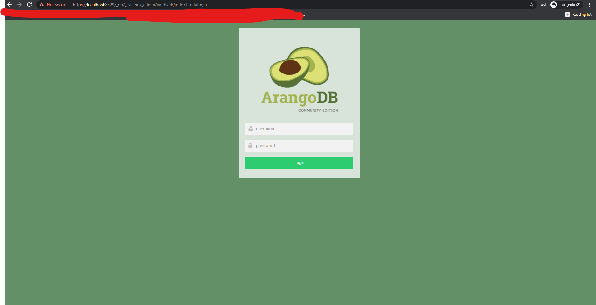

# Configuring Arangodb on Kubernetes cluster.

This repository we are going to understand how we can easly setup arangodb as Loadbalancer service in kubernetes service.

## Follow below mention steps for setup arangodb.

1. Install required CRD's

   ```
       kubectl apply -f https://raw.githubusercontent.com/arangodb/kube-arangodb/1.2.1/manifests/arango-crd.yaml
       kubectl apply -f https://raw.githubusercontent.com/arangodb/kube-arangodb/1.2.1/manifests/arango-deployment.yaml -n arangodb
   ```

2. Run arangodb deployment

   ```
    kubectl apply -f .\arangodb-deployment.yaml -n arangodb
   ```

   after this steps wait for pod creation.

3. check running all pods
   ```
    kubectl get pod
   ```
4. get arangodb load balancer service for access arangodb
   ```
    kubectl get svc
   ```
5. Access arangodb
   type in your browser https://localhost:8529

   

Now your arangodb Setup is done you can ready to use arangodb
